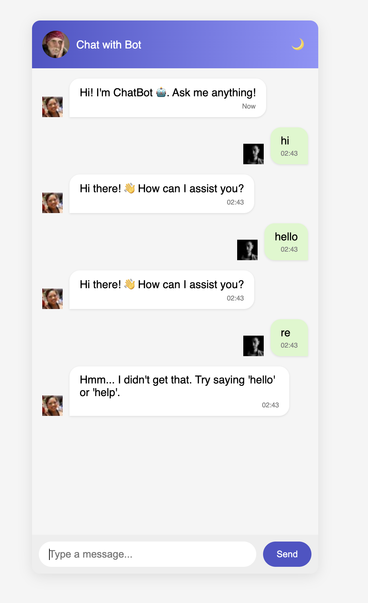

# 💬 Bot Chat App

A simple yet elegant frontend-only chat application built using **HTML**, **CSS**, and **JavaScript**. It simulates a conversation between a user and a rule-based chatbot — complete with time-stamped messages, typing indicators, and dark mode support.

> 🔗 **Live Demo:** [Click Here](https://hrathik007.github.io/Bot_Chat_app)

---

## ✨ Features

- 🧑‍💻 User can type and send messages
- 🤖 Simulated bot replies using predefined rules
- ⏱️ Message timestamps
- 🌙 Dark mode toggle
- 📱 Mobile-responsive layout
- 💬 Typing animation for bot responses
- ⚡ No backend or framework required

---

## 🖼️ Screenshot

> 💡 You can take a screenshot of your app, name it `screenshot.png`, and place it in the repo to show this image on GitHub.

---

## 🧠 Technologies Used

| Layer        | Tech        |
|--------------|-------------|
| Markup       | HTML5       |
| Styling      | CSS3 (Flexbox, Variables) |
| Logic        | JavaScript (ES6+) |

---

## 📁 Folder Structure

